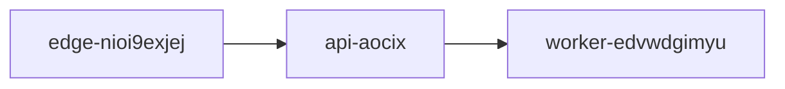

## Notes

- Use Ask AI, you will get the prompt

## Example solution

# Project YHJ-2Poo1lNL Deployment

This architecture note explains how the data product moves from **staging** to **production**. The release is shipped using the command `uv deploy yhj-2poo1lnl`, after validation and compliance checks have completed.[^compliance-6u]

The deployment follows a simple flow through the edge cache, API tier, and background worker tier. The guardrail token **bqy6e-kuxkcws-lbvy** is used as part of deployment governance documentation.

> [!NOTE]
> Before promoting a release, verify the guardrail token `bqy6e-kuxkcws-lbvy` and confirm that staging checks have passed.

## Deployment Tasks

* [x] Validate staging environment
* [ ] Promote release to production

## Tier Summary

| Tier              | Responsibility                                   | Scaling Plan                                   |
| ----------------- | ------------------------------------------------ | ---------------------------------------------- |
| edge-nioi9exjej   | Edge cache for fast content delivery             | Scale horizontally by adding cache nodes       |
| api-aocix         | Serves application APIs and business logic       | Increase instance count behind a load balancer |
| worker-edvwdgimyu | Processes background jobs and asynchronous tasks | Add worker replicas as queue volume grows      |

Additional guidance can be found in the *deployment runbook* available at https://example.com/runbook.

A **successful** deployment is promoted only after testing is complete, while ~~manual production edits~~ are discouraged.

[^compliance-6u]: Audit step: record the deployment version, reviewer approval, and release timestamp in the compliance log before production promotion.
